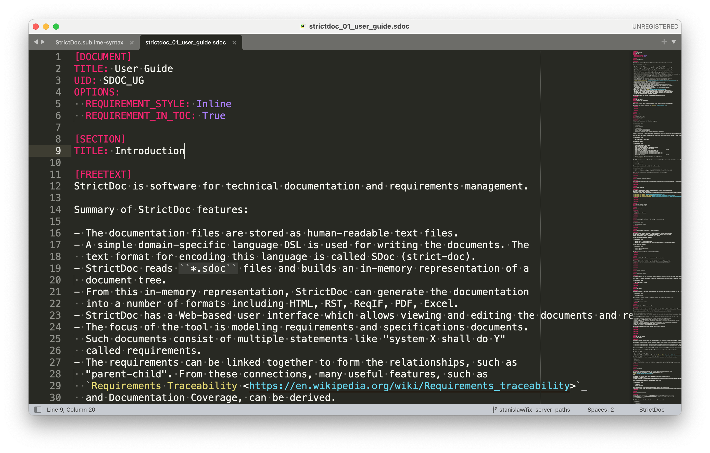

# StrictDoc markup syntax highlighting in Sublime Text



## Installation

Clone this repository to a good place under your file system:

```bash
git clone git@github.com:strictdoc-project/strictdoc.sublime-syntax.git
```

Copy the cloned folder as-is to your Sublime Text's `Packages/User` folder.

```bash
cp -rv strictdoc.sublime-syntax.git <Path-to-Sublime-Text-Packages>
```

To find out where the `Packages` folder is, go to the menu: `Sublime Text / Preferences / Browse Packages...`.

On macOS and for Sublime Text, build 4143, this folder is located at:
`$HOME/Library/Application\ Support/Sublime\ Text\ 3/Packages/User`.
